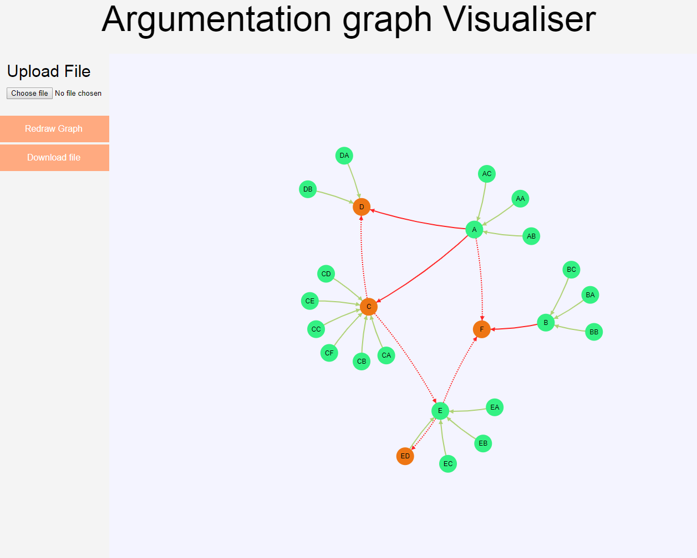
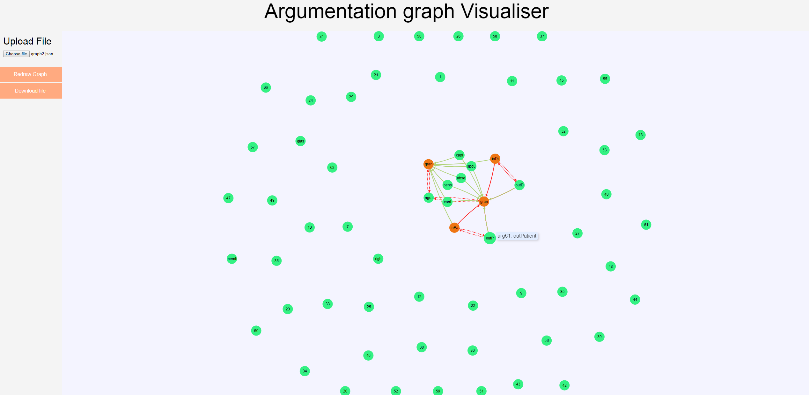

# d3-argumentation
Argumentation Graph Visualisation prototype created for Regis Riveret of Data61 CSIRO

In its current state, this prototype can open and display argumentation graphs in
an interactive manner.

Green arrows represent support relations

Red solid arrows represent rebut attacks

Red dashed arrows represent undercut attacks

To view project, make sure you have python installed and on your path, then 
run python -m http.server 8000 from within the project folder and visit 127.0.0.1:8000 in the browser of your choice

Project comes with 2 argumentation graphs included, where graph.json is the default 
graph loaded on startup

